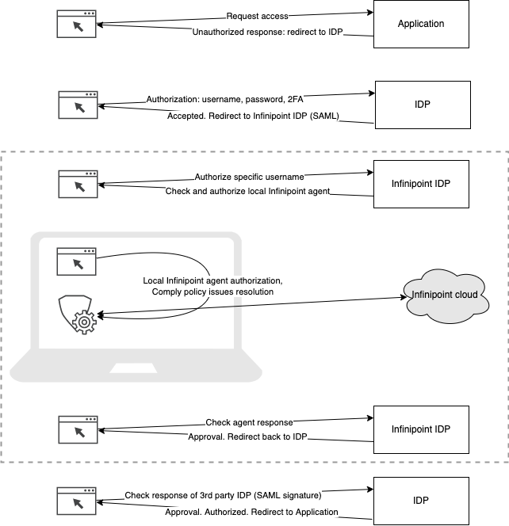
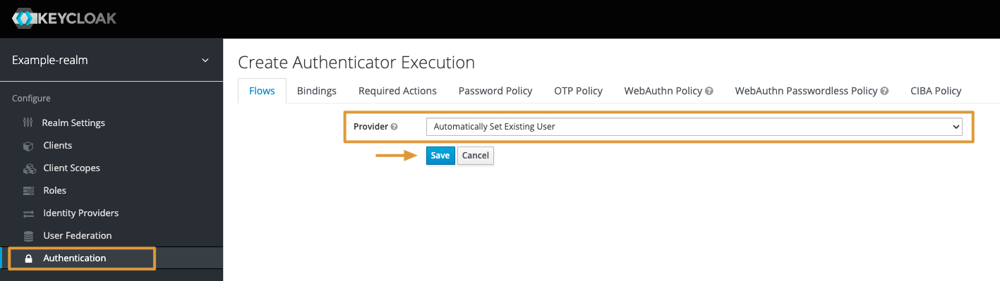
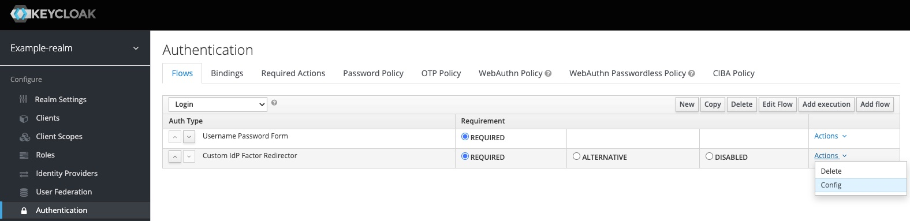

# keycloak-custom-idp-factor
Keycloak extension that redirects to 3rd party IdPs with username as login_hint

### Installation Instructions
Compile the Keycloak extension -  
```bash
mvn clean install
```

This will create a new file called `./target/keycloak-custom-idp-factor-1.0.jar`.   
You will need to copy this file to Keycloak's standalone deployment folder (/opt/jboss/keycloak/standalone/deployments/).  
Keyclaok will automtically reload this plugin, no need to perform a restart.  

## architecture flow diagram


## Using the Plugin to Integrate with Infinipoint DIaaS
In order to integrate with Infinipoint DIaaS, you will need to configure the following objects in Keycloack:  
1. Create a new authentication flow, that will automatically link the user to an Identity Provider
2. Create a new Identity Provider (with metadata provider by Infinipoint) so that you can redirect users to Infinipoint as part of the SSO process. 
3. Modify existing Keycloak authenctions flows, to redirect users to Infinipoint DIaaS

### Create a New Authentication Flow
1. In Keycloak management console, required Realm, navigate to **Authenticaiton** > Click on **new**. 

2. Set an **Alias** e.g. auto-set-user > click **Save**

3. Click on **Add execution** to add an execution to the newly created authentication flow
4. Under **Provider**, select **Automatically Set Existing User**, and click on **Save**

5. Back in the **Authenction** page, Select **Required** for the newly created execution.

### Create a new Identity Provider
1. In Keycloak management console, required Realm, navigate to **Identity Provider**
2. Select **Add prodvider..** from the combo selection box

3. Scroll to the bottom of the page, under **Import External IDP Config**, set the **Import from URL** edit box.
This value should be in the following format - `https://auth.<infinipoint-region>infinipoint.io/auth/realms/<realm-name>/protocol/saml/descriptor`
4. Click on the **Import** button

5. In the same **Add Identity Provider** page, set the following values:  
5.1 **NameID Policy Format**: set to **Unspecified**.  
5.2 **First Login Flow**: set to the name of the newly created authenction flow you created above (e.g. auto-set-user).  
5.3 **Pass subject**: set the **ON**. 
6. Click on **Save** for save the Identity Provider configuration


### Modify Existing Keycloak Authenctions Flow To Redirect to Infinipoint DIaaS
1. In an existing authentication flow, click on add exection.  
2. For **Provider** select **Custom idp Factor Redirector** and click on **Save**.

3. Set the execution to **Required**
4. Click on **Actions** > **Config**

5. Set an **Alias** e.g. redirect to Infinipoint
6. Set the Default Identity Provider to the name of the newly created IdP, e.f. Infinipoint DIaaS IdP
7. Click on **Save**


You can try to login and test flow for a relevant client (application).  
The flow should redirect the user to Infinipoint
